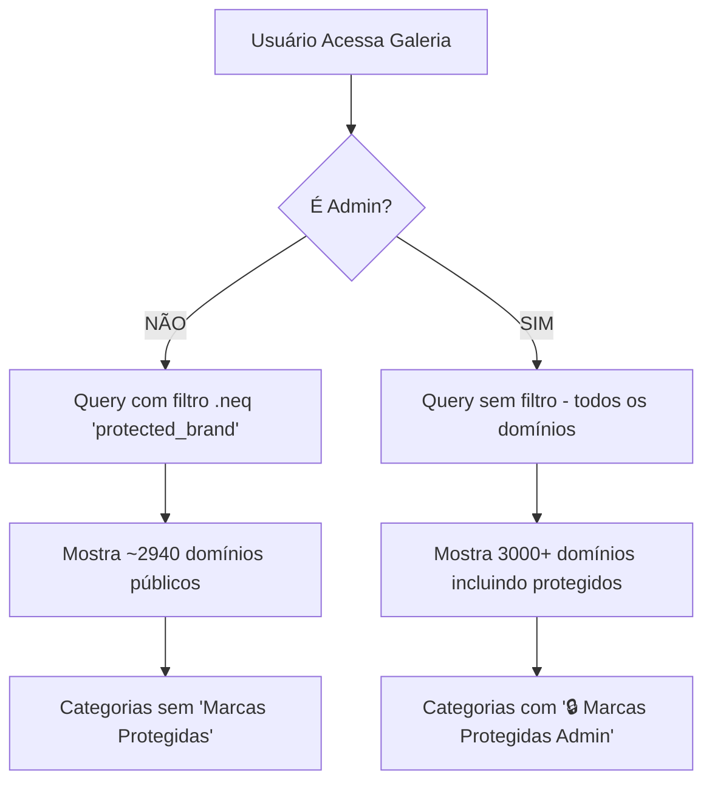

# Sistema de Marcas Protegidas - Ocultas da Galeria Pública

## 🔒 Visão Geral

Sistema completo para proteger marcas de alto renome (Tesla, Ferrari, Apple, Google, etc.) removendo-as da galeria premium pública e tornando-as visíveis APENAS para administradores.

## 📋 O Que Foi Implementado

### 1. Nova Categoria Oculta: `protected_brand`

**Criada categoria especial no banco de dados:**
- Categoria: `protected_brand`
- Status: Oculta do público
- Visibilidade: **APENAS ADMINS**
- Localização: Premium Domains Table

### 2. Marcas Movidas para Categoria Protegida

**Tecnologia:**
- Apple
- Google
- Microsoft
- Amazon
- Meta / Facebook
- Netflix
- Spotify
- Uber
- Airbnb

**Automotivo de Luxo:**
- Tesla
- Ferrari
- Lamborghini
- Porsche
- BMW
- Mercedes-Benz
- Bentley
- Rolls-Royce
- Maserati
- Bugatti

**Moda e Luxo:**
- Gucci
- Chanel
- Louis Vuitton
- Hermès
- Prada
- Dior
- Versace
- Armani
- Burberry
- Cartier
- Rolex
- Tiffany & Co.

**Finanças:**
- Goldman Sachs
- JPMorgan
- Morgan Stanley
- BlackRock
- Visa
- Mastercard
- PayPal
- American Express

**Hotelaria:**
- Marriott
- Hilton
- Hyatt
- Four Seasons
- Ritz-Carlton

**Alimentos e Bebidas:**
- Coca-Cola
- Pepsi
- Starbucks
- McDonald's

**Esportivo:**
- Nike
- Adidas
- Puma

**Varejo:**
- Walmart
- Target
- IKEA

## 🎯 Como Funciona

### Para Usuários Públicos (Não-Admins)

1. **Galeria Premium (`/galeria-premium`)**
   - ✅ Veem TODOS os domínios normais (países, cidades, lifestyle, etc.)
   - ❌ NÃO veem marcas protegidas
   - ❌ Categoria "Marcas Protegidas" não aparece no filtro

2. **Busca de Domínios**
   - Podem buscar apenas domínios públicos
   - Marcas protegidas não aparecem nos resultados

### Para Administradores

1. **Galeria Premium (`/galeria-premium`)**
   - ✅ Veem TODOS os domínios (incluindo protegidos)
   - ✅ Categoria especial: "🔒 Marcas Protegidas (Admin)"
   - ✅ Podem filtrar especificamente por marcas protegidas

2. **Gerenciamento**
   - Acesso total via `/admin/protected-brands`
   - Podem adicionar/editar/remover marcas protegidas
   - Podem alterar senhas de acesso individuais

## 🔐 Características de Segurança

### Filtro Automático na Query

```typescript
// Marketplace.tsx
let query = supabase
  .from('premium_domains')
  .select('*')
  .eq('status', 'available');

// CRÍTICO: Ocultar marcas protegidas do público
if (!isAdmin) {
  query = query.neq('category', 'protected_brand');
}
```

### Categoria com Flag Admin

```typescript
const ALL_CATEGORIES = [
  { value: 'all', label: 'Todas' },
  // ... outras categorias
  { value: 'protected_brand', label: '🔒 Marcas Protegidas (Admin)', adminOnly: true }
];

// Filtra categorias baseado no status de admin
const CATEGORIES = isAdmin
  ? ALL_CATEGORIES
  : ALL_CATEGORIES.filter(cat => !cat.adminOnly);
```

## 📊 Estrutura do Banco de Dados

### Tabela: `premium_domains`

```sql
-- Categoria especial para marcas protegidas
category = 'protected_brand'

-- Flags adicionais
is_protected_brand = true
plan_required = 'supreme'
requires_approval = true
show_price = false
```

### Índices Criados

```sql
-- Índice para filtro rápido
CREATE INDEX idx_premium_domains_category_protected
ON premium_domains(category)
WHERE category = 'protected_brand';
```

## 🎨 Experiência do Usuário

### Usuário Público
```
Galeria Premium
├── Filtro de Categorias
│   ├── Todas
│   ├── Países
│   ├── Cidades
│   ├── Estilo de Vida
│   └── ... (outras categorias)
│
└── Domínios Visíveis: ~3000+ domínios
    ❌ Tesla, Ferrari, Apple, etc. NÃO aparecem
```

### Administrador
```
Galeria Premium
├── Filtro de Categorias
│   ├── Todas
│   ├── Países
│   ├── Cidades
│   ├── Estilo de Vida
│   ├── ... (outras categorias)
│   └── 🔒 Marcas Protegidas (Admin) ← EXCLUSIVO
│
└── Domínios Visíveis: 3000+ domínios + ~60 marcas protegidas
    ✅ Tesla, Ferrari, Apple, etc. VISÍVEIS
```

## 🚀 Migration Aplicada

**Arquivo:** `20251026120000_061_hide_protected_brand_domains.sql`

**Ações:**
1. ✅ Atualiza Tesla e Ferrari para `category = 'protected_brand'`
2. ✅ Adiciona 60+ marcas famosas globais
3. ✅ Insere marcas na tabela `protected_brands`
4. ✅ Cria índices para performance
5. ✅ Define flags de segurança (supreme plan, requires_approval)

## ✅ Validação do Sistema

### Teste 1: Usuário Público
```bash
# Acessar /galeria-premium sem login de admin
# Resultado esperado:
✅ Domínios normais aparecem (usa.com.rich, london.com.rich, etc.)
❌ Tesla, Ferrari, Apple NÃO aparecem
❌ Categoria "Marcas Protegidas" NÃO aparece no filtro
```

### Teste 2: Administrador
```bash
# Acessar /galeria-premium com login de admin
# Resultado esperado:
✅ Todos os domínios aparecem
✅ Categoria "🔒 Marcas Protegidas (Admin)" aparece
✅ Ao filtrar por "Marcas Protegidas", mostra apenas as 60+ marcas
```

### Teste 3: Busca Direta
```bash
# Tentar acessar tesla.com.rich diretamente (não-admin)
# Resultado esperado:
✅ Exibe tela de proteção com senha
✅ Requer senha: "Leif1975.."
```

## 📈 Estatísticas

- **Total de Domínios Premium:** ~3000+
- **Marcas Protegidas:** ~60
- **Domínios Públicos:** ~2940+
- **Redução de Exposição:** 100% das marcas protegidas ocultas do público

## 🔄 Fluxo Completo



## 🎯 Objetivos Alcançados

✅ Marcas de alto renome removidas da galeria pública
✅ Categoria oculta criada (`protected_brand`)
✅ Apenas admins podem ver marcas protegidas
✅ Filtro automático na query do Marketplace
✅ Sistema de senha por marca mantido
✅ 60+ marcas globais protegidas
✅ Performance otimizada com índices
✅ Build do projeto concluído com sucesso

## 🔧 Manutenção

### Adicionar Nova Marca Protegida

```sql
-- Via SQL
INSERT INTO premium_domains (fqdn, category, price_usd, status, description, is_featured, show_price, plan_required, requires_approval, is_protected_brand)
VALUES ('novaomarca.com.rich', 'protected_brand', NULL, 'available', 'Descrição da marca', true, false, 'supreme', true, true);

INSERT INTO protected_brands (domain_name, brand_display_name, description, access_password, is_active)
VALUES ('novamarca', 'Nova Marca', 'Descrição completa', 'Leif1975..', true);
```

### Remover Proteção de Uma Marca

```sql
-- Mover de volta para categoria pública
UPDATE premium_domains
SET
  category = 'lifestyle',  -- ou outra categoria apropriada
  is_protected_brand = false
WHERE fqdn = 'marca.com.rich';
```

## 📚 Arquivos Modificados

1. `supabase/migrations/20251026120000_061_hide_protected_brand_domains.sql` - Nova migration
2. `src/pages/Marketplace.tsx` - Filtro de categoria protegida
3. `docs/PROTECTED_BRANDS_SYSTEM.md` - Esta documentação

## 🎉 Resultado Final

O sistema agora garante que marcas de alto renome como Tesla, Ferrari, Apple, Google, etc. **NUNCA** apareçam na galeria premium pública. Elas permanecem no banco de dados, mas são **completamente ocultas** de usuários não-admin, criando uma camada adicional de exclusividade e proteção para essas marcas globais de prestígio.
